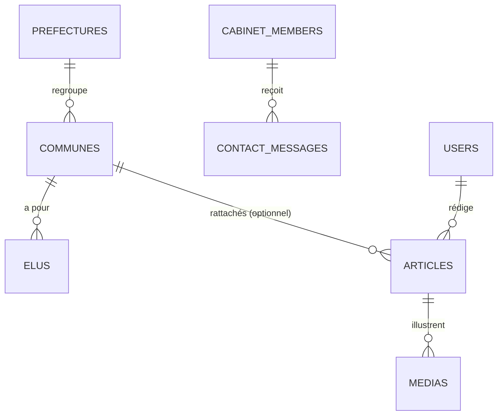

# Plan de conception — Portail du Gouvernorat de l'Île Autonome de Ngazidja

Stack cible : **Laravel 12** · **Filament 3** (back-office) · **Inertia.js + React** (site public).

---

## 1. Nature du projet

D'après la maquette, il s'agit d'un **site institutionnel de consultation** (type CMS), pas d'un portail de démarches avec comptes citoyens. Les contenus sont gérés par l'administration et consultés par le grand public.

Périmètre fonctionnel identifié dans la maquette :

- Accueil (héro, mot du Gouverneur, carte des communes, dernières actualités, agenda).
- Le Gouverneur (biographie, vision, citation).
- Cabinet (organigramme : Gouverneur, direction, conseillers, support) + contact par membre.
- Communes (carte SVG interactive de l'île, fiche détaillée par commune avec maire, adjoints, statistiques, atouts/défis).
- Actualités (articles typés vidéo / photo / infographie, avec article « à la une » et articles rattachés à une commune).
- Médiathèque (galerie, discours & citations).
- Agenda officiel (événements publics / privés).
- Contact (formulaire vers un membre du cabinet — en `mailto` dans la maquette, à serveuriser).

Le « multi-rôles » que tu visais s'applique donc **côté gestion de contenu** (administrateurs, éditeurs, gestionnaires territoriaux), et non à des usagers connectés.

---

## 2. Architecture technique

### 2.1 Recommandation sur React (réponse à « conseille-moi »)

**Inertia.js + React, dans un monolithe Laravel unique**, avec rendu côté serveur (Inertia SSR).

Pourquoi pas une SPA React découplée + API :

- Le site est avant tout du **contenu** : le SEO et le partage sur les réseaux comptent pour une institution. Une SPA pure pénalise l'indexation ; Inertia SSR rend du HTML complet.
- Pas de second consommateur d'API (pas d'app mobile prévue) : une API découplée ajouterait CORS, jetons, double déploiement, sans bénéfice.
- La seule vraie interactivité (carte SVG cliquable, modales de fiche commune, filtres, onglets médiathèque) s'exprime parfaitement en **composants React encapsulés dans des pages Inertia**.

On réserverait la SPA découplée uniquement si une application mobile native ou plusieurs frontends devaient consommer la même API.

### 2.2 Vue d'ensemble

- **Filament 3** : back-office complet (un seul panneau `/admin`, accès filtré par rôle) pour gérer tout le contenu.
- **Inertia + React (SSR)** : site public, pages rendues par Laravel, hydratées par React pour les parties interactives.
- **Base de données** : PostgreSQL (recommandé) ou MySQL.
- **Cache & files d'attente** : Redis (envoi d'emails de contact, génération de miniatures, sitemap).
- **Stockage médias** : disque S3 (ou local en phase 1), via `spatie/laravel-medialibrary`.
- **Rôles** : `spatie/laravel-permission`.

---

## 3. Rôles et permissions

Via `spatie/laravel-permission`, appliqués dans Filament (visibilité des ressources) et dans les Policies Laravel.

| Rôle | Périmètre |
|------|-----------|
| Super-administrateur | Tout, y compris utilisateurs, rôles et paramètres. |
| Administrateur | Tous les contenus + utilisateurs (hors super-admin). |
| Éditeur | Actualités, médiathèque, agenda. |
| Gestionnaire territorial | Préfectures, communes, élus. |
| Référent cabinet | Membres du cabinet, messages de contact (option). |

---

## 4. Modèle de données

Champs déduits directement des structures de la maquette (`PREF`, `COMMUNES`, `ARTICLES`, `CABINET`, `AGENDA`).

### 4.1 `prefectures` (8)
`id`, `slug`, `nom`, `chef_lieu`, `couleur` (hex), `est_capitale` (bool), `label_x`, `label_y` (position du libellé sur la carte), `ordre`.

### 4.2 `communes` (28)
`id`, `slug`, `nom`, `prefecture_id`, `est_chef_lieu` (bool), `couleur`, `svg_path` (le tracé `d` de la carte), `centroid_x`, `centroid_y` (point `c`), `population`, `foyers`, `nb_conseillers`, `nb_villages`, `gouvernance` (texte), `atouts` (json ou table liée), `defis` (json ou table liée).

> La carte est le point délicat : il faut **reprendre tels quels les tracés SVG** de la maquette (champ `svg_path`) et les stocker en base, pour que la carte reste pilotée par les données.

### 4.3 `elus`
`id`, `commune_id`, `nom`, `role` (enum : `maire`, `1er_adjoint`, `2e_adjoint`, `conseiller`), `ordre`, `photo`. Le maire et les adjoints de chaque commune en sont des lignes ; le conseil d'administration peut rester un simple compteur (`nb_conseillers`).

### 4.4 `articles`
`id`, `slug`, `type` (enum : `video`, `photo`, `info`), `categorie`, `titre`, `extrait`, `contenu` (riche), `date_publication`, `est_a_la_une` (bool), `commune_id` (nullable, pour les articles de commune), `statut` (`brouillon`, `publie`), `user_id` (auteur), `media_principal`.

### 4.5 `medias` (médiathèque)
`id`, `type` (`photo`, `video`, `infographie`), `titre`, `chemin`/`url`, `article_id` (nullable), `dans_mediatheque` (bool), `ordre`. (Géré idéalement via Media Library.)

### 4.6 `cabinet_members`
`id`, `slug`, `nom`, `role`, `niveau` (enum : `gouverneur`, `direction`, `conseiller`, `support`), `email`, `telephone`, `photo`, `ordre`.

### 4.7 `agenda_events`
`id`, `titre`, `date`, `lieu`, `statut` (`public`, `prive`), `description`.

### 4.8 `contact_messages`
`id`, `cabinet_member_id`, `nom`, `email`, `objet`, `message`, `statut` (`nouveau`, `traite`), `created_at`.

### 4.9 Contenus éditoriaux du Gouverneur
Biographie, vision, citation (« mot du Gouverneur ») : à gérer en **enregistrements de réglages** (par ex. `spatie/laravel-settings` ou une page Filament dédiée) plutôt qu'en table multi-lignes.

### 4.10 `users` + rôles
Comptes du back-office uniquement, avec rôles/permissions Spatie.

---

## 5. Back-office Filament — ressources

Un seul panneau `/admin`, ressources visibles selon le rôle.

| Ressource | Points notables |
|-----------|-----------------|
| `PrefectureResource` | Champs carte (`label_x/y`, couleur), `RelationManager` des communes. |
| `CommuneResource` | `RelationManager` des élus ; `atouts`/`defis` en `Repeater` ou tags ; champ `svg_path` (zone de texte, modifié rarement) ; statistiques. |
| `ArticleResource` | Éditeur riche, `type`, `categorie`, bascule « à la une », rattachement commune optionnel, statut + planification de publication. |
| `MediaResource` | Upload (Media Library), type, ordre, présence en médiathèque. |
| `CabinetMemberResource` | `niveau` + `ordre` pour reconstituer l'organigramme ; email/téléphone/photo. |
| `AgendaEventResource` | Date, lieu, statut public/privé. |
| `ContactMessageResource` | En lecture (boîte de réception), passage à « traité », notification à l'arrivée. |
| Page « Contenus du Gouverneur » | Bio, vision, citation (réglages). |
| `UserResource` + gestion des rôles | Réservé aux administrateurs. |

Tableau de bord : widgets nombre d'articles publiés, derniers messages de contact, prochains événements.

---

## 6. Site public (Inertia + React)

Pages, correspondant aux routes de la maquette (`#/...` → vraies routes Laravel) :

| Route | Page | Interactivité React |
|-------|------|---------------------|
| `/` | Accueil | Carte des communes, carrousels légers. |
| `/gouverneur` | Le Gouverneur | — |
| `/cabinet` | Cabinet | Organigramme, modale de contact. |
| `/communes` | Communes | **Carte SVG interactive** + filtres par préfecture. |
| `/commune/{slug}` | Fiche commune | Modale / fiche détaillée. |
| `/actualites` | Actualités | Filtres par catégorie. |
| `/article/{slug}` | Article | — |
| `/mediatheque` | Médiathèque | Onglets vidéo / photo / infographie. |
| `/agenda` | Agenda | — |
| `/contact` | Contact | Formulaire (envoi serveur). |

Composants React clés : `CarteNgazidja` (alimentée par les `svg_path` des communes via props Inertia), `FicheCommune`, `OrganigrammeCabinet`, `FiltreActualites`, `MediathequeTabs`, `FormulaireContact`.

Le formulaire de contact, en `mailto:` dans la maquette, devient un **envoi côté serveur** : validation, anti-spam (honeypot + rate limiting), enregistrement en `contact_messages` et notification e-mail au membre concerné.

---

## 7. Charte graphique (extraite de la maquette)

À transposer en tokens Tailwind / variables CSS du frontend.

**Couleurs**

| Rôle | Hex |
|------|-----|
| Bleu nuit (texte/fonds profonds) | `#071A33` |
| Bleu Ngazidja (officiel) | `#08457E` |
| Bleu actif | `#14609E` |
| Azur (liens) | `#2E8FD6` |
| Azur pâle (fonds doux) | `#E8F1FA` |
| Or (CTA) | `#C8A24A` |
| Or clair | `#E3C878` |
| Vert archipel (accent rare) | `#1F7A5C` |

**Typographies** : Fraunces (titres, serif) · Instrument Sans (corps) · Archivo (labels / eyebrows en majuscules espacées).

**Formes** : rayons `18px` / `12px`, boutons en pilule (`999px`), ombres douces, dégradé or réservé aux CTA principaux.

---

## 8. Médias et fichiers

- `spatie/laravel-medialibrary` pour les uploads, conversions et images responsives.
- Photos d'illustration : la maquette utilise des emplacements ; il faudra **fournir les vrais visuels** (Gouverneur, communes, événements).
- Vidéos : privilégier l'embarquement (hébergeur tiers) plutôt que l'hébergement direct, pour la bande passante.

---

## 9. Sécurité et conformité

- 2FA pour les comptes du back-office (Filament + Fortify).
- Policies par ressource, alignées sur les rôles Spatie.
- Journal d'audit (`owen-it/laravel-auditing`) sur les contenus sensibles.
- Données personnelles des élus et messages de contact : durée de conservation, accès restreint, mentions légales.
- Validation stricte des uploads (type, taille) ; rate limiting et honeypot sur le formulaire de contact.

---

## 10. SEO, performance et international

- Inertia **SSR** + balises meta / Open Graph par page, sitemap XML, URLs propres (slugs).
- Cache de fragments/contenus publiés ; CDN pour les médias.
- i18n possible (français par défaut ; comorien et/ou arabe à prévoir si besoin).

---

## 11. Phasage proposé

1. **Fondations** : Laravel 12, Filament, rôles, modèle de données, import des 8 préfectures et 28 communes (avec tracés SVG).
2. **Back-office contenu** : ressources Filament (communes/élus, articles, cabinet, agenda, médiathèque, contenus du Gouverneur).
3. **Site public** : Inertia + React, intégration de la charte, carte interactive, toutes les pages.
4. **Transverse** : formulaire de contact serveur, notifications, médiathèque, SEO/SSR, sitemap.
5. **Durcissement** : 2FA, audit, conformité, performance, tests, déploiement.

---

## 12. Points à confirmer

- **Carte SVG** : on conserve les tracés exacts de la maquette (stockés en base) — confirmé ?
- **Visuels réels** à fournir (photos Gouverneur, communes, événements) : qui les produit ?
- **Cabinet** : la plupart des membres sont « À renseigner » dans la maquette — données réelles disponibles ?
- **Contact** : passage du `mailto` à un envoi serveur avec boîte de réception — d'accord ?
- **Langues** : uniquement français, ou prévoir comorien/arabe ?
- Volumétrie et hébergement cible (pour trancher PostgreSQL/MySQL, S3/local, SSR Node).
